<h1>APP WEB SERVICE SOAP</h1>

<h3>Structure de projet</h3>
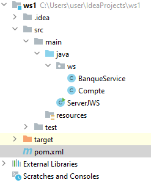
<h3>Web Service (BanqueService)</h3>
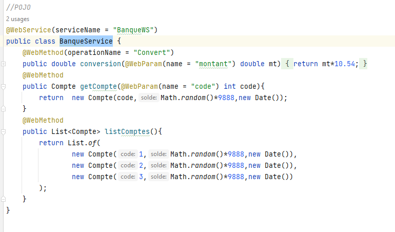
<h3>Class Compte</h3>
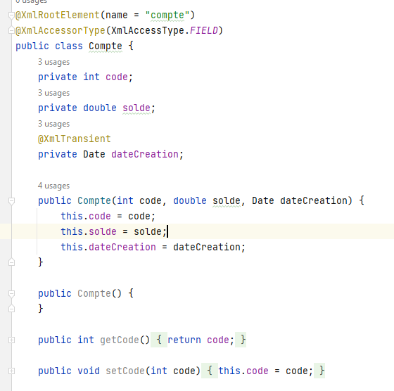
<h3>Depandance JAX-WS</h3>
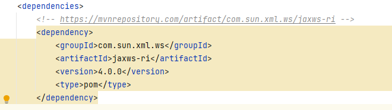
<h3>Deployer WebService dans le serveur JAX-WS </h3>
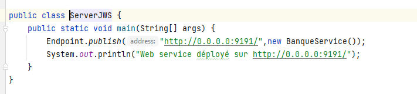
<h3>Fichier WSDL</h3>
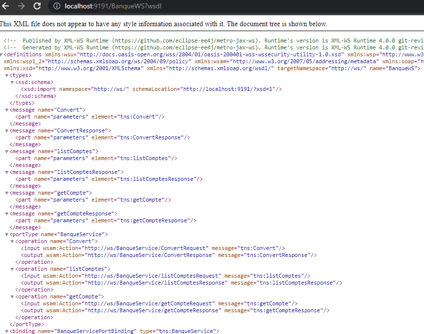
<h3>SOAP UI </h3>
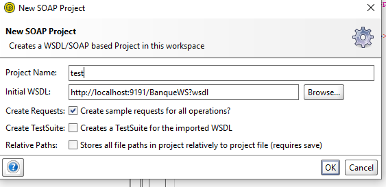
 
 
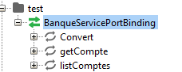
 
 
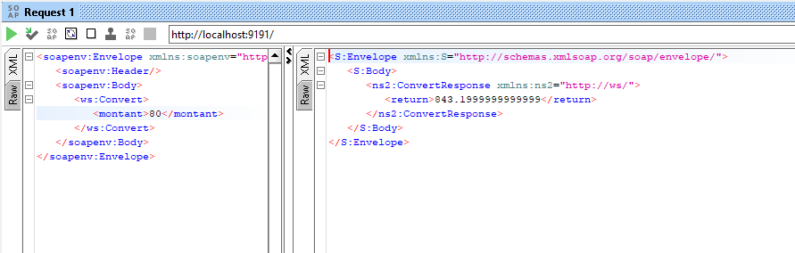
 
 
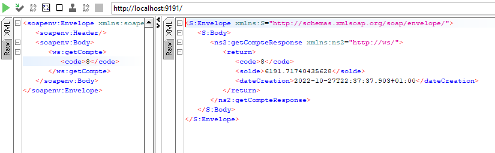
 
 
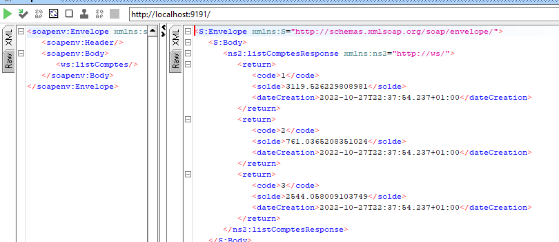
<h3>Client JAVA </h3>
<h5>Structure du projet</h5>
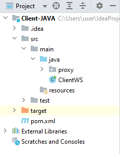
 
<h5>Generation du java code depuis WSDL</h5>
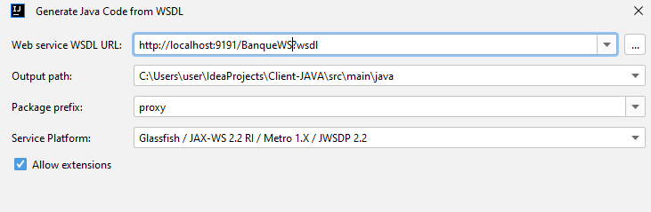
<h5>class du client de webservice (utilisation du websercie par le client)</h5>
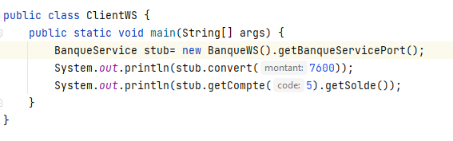
<h5>Resultat</h5>
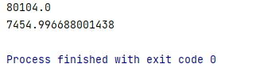
<h3>Client .NET</h3>
<h5>Creation de reference du service</h5>
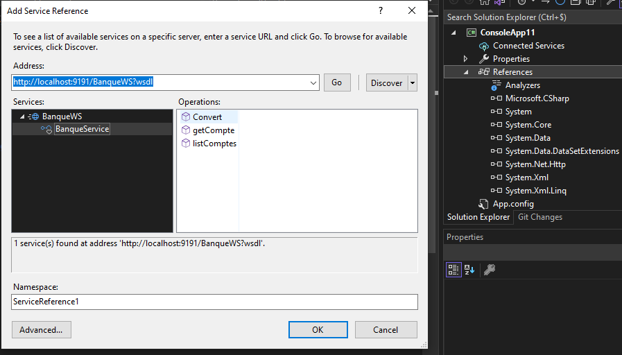
<h5>utilisation du websercie par le client</h5>
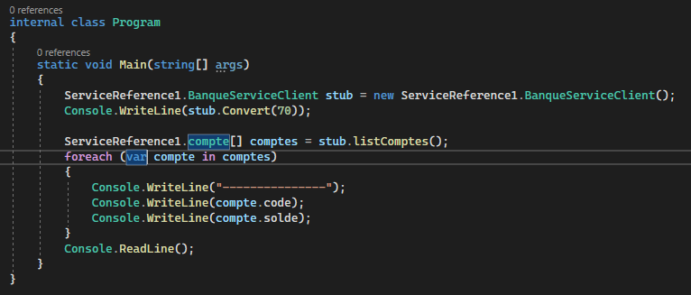
<h5>Resultat</h5>
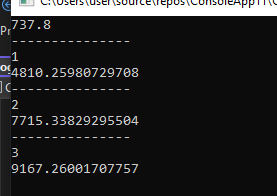